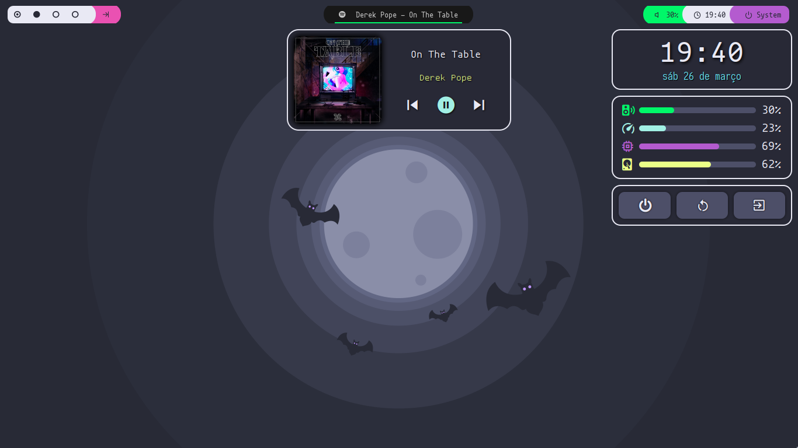
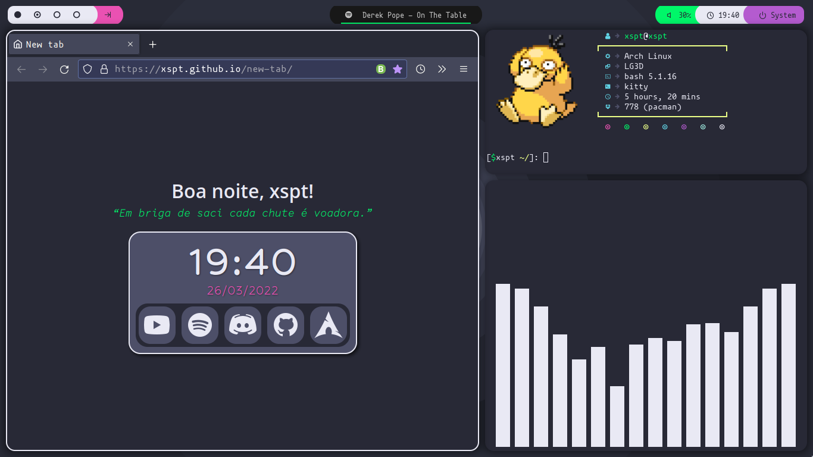
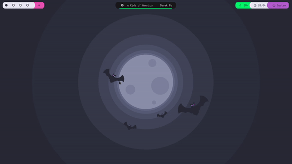
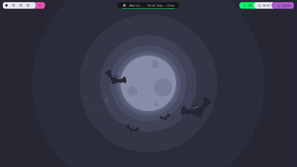

# mydotfiles

These are my linux desktop config files.

If you're interested in those kind of things check [r/unixporn](https://www.reddit.com/r/unixporn) for more.

## Infos

- **🪟 Wm:** [Bspwm](https://github.com/baskerville/bspwm)
- **🍫 Bar:** [Polybar](https://github.com/polybar/polybar)
- **🐱 Terminal:** [Kitty](https://github.com/kovidgoyal/kitty)
- **🤮 Widgets:** [Eww](https://github.com/elkowar/eww)
- **🖼️ Fetch:** [Neofetch](https://github.com/dylanaraps/neofetch) ([Idlidev](https://github.com/Idlidev/.dotfiles/blob/master/.config/neofetch/config.conf) config)
- **👁️ Compositor:** [Picom](https://github.com/yshui/picom) (Using ibhagwan's [fork](https://github.com/ibhagwan/picom))
- **🎨 Color manager:** [Pywal](https://github.com/dylanaraps/pywal) ([Dracula](https://github.com/dracula/dracula-theme) palette)

## Images

Widgets

Custom [browser homepage](https://github.com/Xspt/new-tab)

## Warning

If you want to try these configs be aware that the [install.py](https://github.com/Xspt/mydotfiles/blob/main/install.py) script isn't really tested, so I recommend you to do your own backup and use this script only to install the files to ~/.config/

## TODO

- [ ] Make a better install script
- [ ] Polish and comment the config files
- [ ] Record screen widget
- [X] Add GIF to README
- [X] Adjust picom shadows
- [X] Adjust eww windows position
